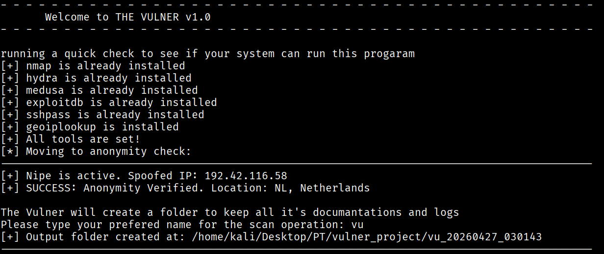
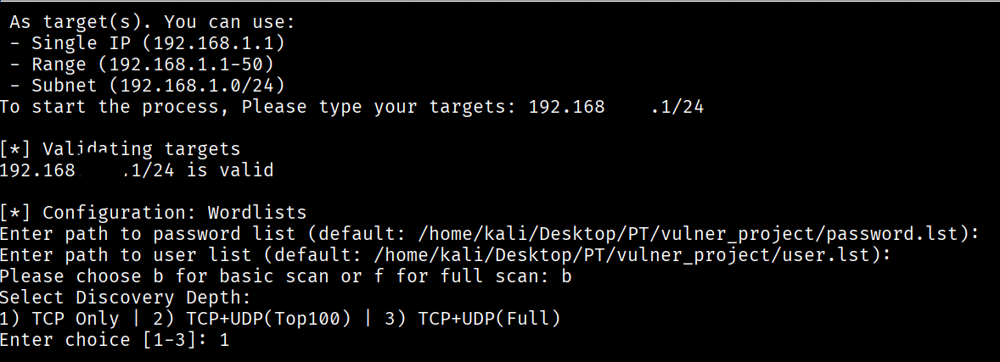
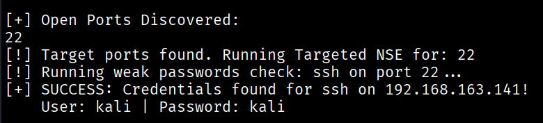
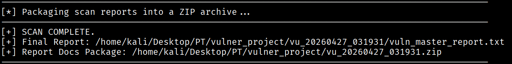

# THE VULNER v1.0
### Automated Forensic Framework for Network Reconnaissance & Vulnerability Auditing

> **Course:** Cyber Magen (TMagen773638) — John Bryce Training, Tel Aviv  
> **Author:** Uri Wertheim  
> **Lecturer:** Natalie Erez  

---

## Overview

THE VULNER is a modular, automated penetration testing framework built to streamline the full lifecycle of network reconnaissance, vulnerability analysis, and credential auditing.

Designed with operational security (OpSec) at its core, the framework orchestrates industry-standard tools — Nmap, Hydra, Medusa — through an automated pipeline that takes a target network from anonymous footprinting all the way to a packaged forensic report, with minimal manual intervention.

---

## Features

- **Pre-Flight Validation** — Checks for root privileges and verifies all required dependencies before execution. Missing tools are auto-installed (self-healing).
- **Anonymity Layer (OpSec)** — Initialises Nipe/Tor routing to obfuscate the operator's origin before any packets are sent.
- **Modular Pipeline Architecture** — Discovery → Vulnerability Analysis → Credential Audit run as isolated modules. Failure in one does not corrupt the others.
- **Configurable Scan Depth** — Three modes from rapid TCP SYN scan (top 100 ports) to full forensic depth (all 65,535 TCP + top 2,000 UDP ports).
- **Intelligent Target Validation** — Automatically skips unresponsive hosts, eliminating runtime errors and log noise on large subnet scans.
- **Automated Forensic Reporting** — All logs are aggregated into a unified `vuln_master_report.txt` and compressed into a timestamped ZIP archive, ready for delivery.

---

## Tools & Technologies

| Tool | Purpose |
|------|---------|
| `Nmap` + NSE | Network discovery and vulnerability scanning |
| `Hydra` / `Medusa` | Credential auditing and dictionary attacks |
| `Nipe` / `Tor` | Traffic obfuscation and anonymity |
| `sshpass` | SSH credential automation |
| `geoiplookup` | IP geolocation verification |
| `Bash` | Core scripting language |
| `Kali Linux` | Operating environment |

---

## Pipeline Flow

```
1. Initialization     → Root check + dependency validation + auto-install
2. Anonymity Layer    → Nipe/Tor activation + spoofed IP verification
3. Discovery Phase    → Nmap scan → .snapshot file (source of truth)
4. Vulnerability Analysis → NSE scans on open/verified ports only
5. Credential Audit   → Hydra/Medusa dictionary attacks on discovered services
6. Reporting          → Aggregate logs → vuln_master_report.txt → ZIP archive
```

## Screenshots

```
### Pre-Flight Validation & OpSec Initialization


### Target Reconnaissance & Scan Configuration


### Credential Audit — Weak Passwords Found


### Forensic Report Packaging

---

**## Usage
**
```bash
# Unpack the project
unzip vulner_project.zip
cd vulner_project

# Run with admin privileges
sudo bash vulner.sh
```

The interactive CLI will guide you through:
1. **Project name** — used as the directory and archive identifier
2. **Wordlists** — use defaults or provide custom paths for `user.lst` / `password.lst`
3. **Scan strategy** — Basic (B) or Full (F)
4. **Discovery depth** — Mode 1 (TCP top 100) / Mode 2 (TCP+UDP top 1000) / Mode 3 (Full forensic depth)

---

## Scan Modes

| Mode | Scope | Use Case |
|------|-------|---------|
| Mode 1 — TCP Standard | Top 100 TCP ports (SYN scan) | Rapid reconnaissance |
| Mode 2 — TCP + UDP Top 1000 | TCP + common UDP (DNS, DHCP, TFTP) | Balanced visibility |
| Mode 3 — Full Forensic Depth | All 65,535 TCP + top 2,000 UDP | High-security environments |

> **Note:** UDP results are flagged for manual verification due to the inherent unreliability of UDP timeouts in virtualised environments. Run `nmap -Pn -sU -sV -p [PORT] [IP]` to confirm.

---

## Output

On completion, THE VULNER generates a timestamped directory (e.g. `vu_20260509_014438`) containing:
- Individual scan logs per target/service
- `vuln_master_report.txt` — unified findings report
- A compressed `.zip` forensic package ready for delivery

---

## Engineering Decisions & Challenges

| Challenge | Solution |
|-----------|---------|
| Environment portability | `tools_setup` function auto-installs missing dependencies on any Linux distro |
| Duplicate service scanning | `sort -u` deduplication during snapshot extraction |
| Special characters breaking filenames | `sed`-based normalisation layer for filesystem-safe output |
| Script architecture scaling | Relay pattern for passing state across modular functions |
| UDP reliability vs. completeness | Strategic decision to prioritise 100% reliable output over unverified automation |

---

## ⚠️ Disclaimer

This framework is developed for **educational purposes** and **authorised penetration testing only**. Use only on networks and systems you own or have explicit written permission to test. Unauthorised use is illegal.

---

## Author

**Uri Wertheim** — Cybersecurity Student | Sound Engineer  
John Bryce Training, Tel Aviv | Cyber Magen Graduate  
[GitHub](https://github.com/wertheimuri) · [LinkedIn](https://www.linkedin.com/in/uri-wertheim-48734027/)
